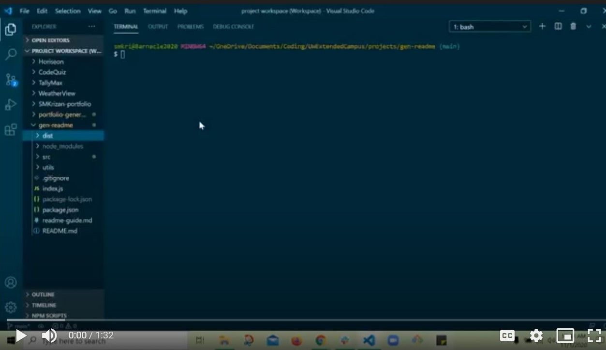

# Professional README Generator

## DESCRIPTION
A command-line application that prompts the user for input about their GitHub repository project and generates a high-quality, professional README.md file. The generated readme will display the project title and sections entitled: Description, Table of Contents, Installation, Usage, License, Contributing, Tests, and Questions.

## <a name="table-of-contents">TABLE of CONTENTS</a>
* [Installation](#installation)
* [Usage](#usage)
* [Credits](#credits)

## <a name="installation-instructions">INSTALLATION INSTRUCTIONS</a>
1. Install [Node.js](https://nodejs.org/en/)
2. Clone the repository to your computer
3. Within your terminal, navigate to the file location of the cloned repository
4. Enter "node index.js" into the terminal.

## <a name="usage">USAGE</a>
The following video provides a walkthrough of the application functionality and output:

[*Follow link below for walkthrough of application*][https://drive.google.com/file/d/1hOT9PKYvzAL-POT5jI0g5kbRbdmTOvHc/preview]

<iframe src="https://drive.google.com/file/d/1hOT9PKYvzAL-POT5jI0g5kbRbdmTOvHc/preview" width="400" height="300"></iframe>

## <a name="credits">CREDITS</a>

Made with ☕+❤️ by Sara Krizan and in consultation with several LAs, TA, and learning instructor through the University of Wisconsin Extended Campus Coding Bootcamp, in addition to the tutorial below:

https://about.gitlab.com/handbook/markdown-guide/
[GitHub](https://gitlab.com/gitlab-com/www-gitlab-com/blob/master/sites/handbook/source/handbook/markdown-guide/index.html.md)